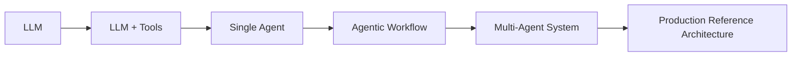
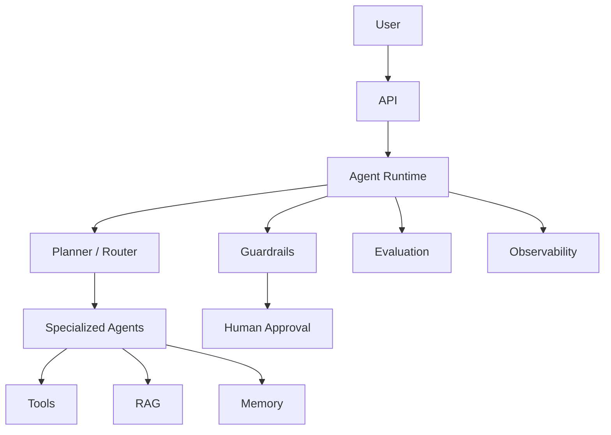

# Agentic AI Engineering Lab

This repository is evolving from a concept demo into a reference lab for engineering reliable agentic AI systems.

The core thesis is simple:

> Building an agent is easy. Engineering a reliable agentic system is the hard part.

## What this repository is

This project teaches the progression from direct LLM calls to controlled agentic systems while emphasizing:

- explicit state
- tool control
- observability
- evaluation
- failure handling
- operational trade-offs

It is intentionally small, local-first, and Python-native.

## Why agentic systems are different from simple LLM applications

A prompt-response app can often be evaluated by whether a single answer looks good.

An agentic system must instead be engineered across multiple dimensions:

- Did it choose the right tool?
- Did it pass valid arguments?
- Did state change correctly between steps?
- Did it stop when it should?
- Can you observe, debug, and replay failures?
- Is the additional autonomy worth the latency and cost?

## Architecture progression



## Design principle

More autonomy is not automatically better.

Every example should help you reason about trade-offs:

- determinism vs autonomy
- reliability vs flexibility
- cost vs capability
- latency vs reasoning depth
- centralized control vs delegated decision-making

## Repository structure

### Implemented foundations

```text
agentic-ai-vs-ai-agents/
├── agentic_ai_lab/          # shared config, model, logging, runtime helpers
├── 01_llm/                  # direct LLM usage
├── 02_ai_agent/             # tool-enabled agent
├── 03_agentic_workflow/     # explicit state graph
├── 04_multi_agent/          # specialized agent collaboration
├── 05_real_world_demo/      # small end-to-end content pipeline
├── tests/                   # unit and workflow structure tests
├── .github/workflows/       # CI
├── pyproject.toml           # project metadata and tooling
├── requirements.txt         # compatibility install entry point
└── Makefile                 # developer tasks
```

### Planned engineering sections

- `06_memory/`
- `07_rag_agents/`
- `08_guardrails/`
- `09_human_in_the_loop/`
- `10_evaluation/`
- `11_observability/`
- `12_failure_modes/`
- `13_advanced_patterns/`
- `14_production_reference/`

## Getting started

### 1. Create a virtual environment

```bash
python -m venv .venv
source .venv/bin/activate
```

### 2. Install dependencies

```bash
pip install -r requirements.txt
```

For contributor tooling:

```bash
make install-dev
```

### 3. Configure environment variables

```bash
cp .env.example .env
```

Required:

- `OPENAI_API_KEY`

Optional:

- `OPENAI_MODEL` (default: `gpt-4o-mini`)
- `OPENAI_BASE_URL`
- `LANGCHAIN_API_KEY`
- `LANGCHAIN_TRACING_V2`
- `LANGCHAIN_PROJECT`
- `LOG_LEVEL`

### 4. Run the examples

```bash
python 01_llm/simple_llm.py
python 02_ai_agent/agent.py
python 03_agentic_workflow/workflow.py
python 04_multi_agent/workflow.py
python 05_real_world_demo/research_agent.py
```

## Examples

### 01 - LLM

Direct model invocation with shared runtime configuration.

### 02 - AI Agent

Modern LangChain agent using tools and controlled prompting.

### 03 - Agentic Workflow

Explicit LangGraph state transitions for outline → draft → review.

### 04 - Multi-Agent

Researcher, writer, and reviewer collaborate through shared workflow state.

### 05 - Real-World Demo

A compact planner/researcher/editor pipeline that demonstrates multi-step orchestration.

## Memory

Planned. This section will distinguish context, state, conversational memory, and persistent memory, including when not to use memory.

## RAG

Planned. The future RAG section will cover ingestion, chunking, embeddings, retrieval, context construction, and agent/tool integration.

## Guardrails

Planned. The lab will add allowlists, validation, limits, authorization checks, and graceful termination patterns.

## Human-in-the-loop

Planned. High-risk actions will require explicit approval in a safe local demo flow.

## Evaluation

Planned. The repository will add deterministic benchmarks and metrics for success rate, tool quality, latency, tokens, and cost.

## Failure modes

Planned. A dedicated failure lab will demonstrate retries, fallbacks, termination, and escalation patterns.

## Observability

Foundation added. Shared logging/config helpers now exist, and later sections will expand this into tracing, run metadata, and structured execution records.

## Advanced patterns

Planned. ReAct, router, planner/executor, reflection, retry/fallback, supervisor, and hierarchical patterns will be added with failure analysis.

## Production architecture

Planned target:



## Configuration and engineering conventions

- Python 3.11+
- `pyproject.toml` is the source of truth for dependencies and tooling
- `requirements.txt` installs the local package for simple onboarding
- `pytest` is used for tests
- `ruff` is used for linting and formatting checks
- examples use environment variables instead of hardcoded credentials

## Developer commands

```bash
make lint
make format
make format-check
make test
```

## Design trade-offs

- A graph is usually easier to debug than a fully autonomous loop.
- More tools increase capability but also expand failure surface area.
- Multi-agent designs can improve specialization but often add latency and coordination cost.
- Observability and evaluation are features, not optional polish.

## Limitations

- The current repository still focuses on foundational examples.
- Memory, RAG, guardrails, evaluation, observability, and production sections are not yet fully implemented.
- Most examples are illustrative and not yet benchmarked against a formal dataset.

## Diagrams

See `/diagrams` for simple supporting visuals used by the current learning modules.
